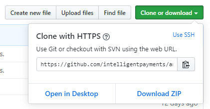

## Pre-condition

Please note that the call from the Merchant Server to the IPG Gateway API for obtaining an IPG Gateway “Session Token” has been updated. (This update is due to additional data fields mandated by 3DS-Version 2 compliance). It is a prerequisite that the Session Token passed to the Mobile SDK is obtained from that updated Get Session Token API endpoint.

## Installation

#### Manually (Recommended)

1. Clone this project or download zip file with source code, by clicking green button in top right corner:



2. If zip file was downloaded, extract it.
3. Open extracted or cloned folder, and run command in terminal:
```
git checkout <version>
```
Where `<version>` is version of SDK you want to use, e.g. `git checkout 1.0`.
All available version you can find [here](https://github.com/eservice-electronic-payments/Mobile_SDK_Android_UAT/releases)

4. Open your project in Android Studio.
5. Open file `settings.gradle` - it is in your project's root directory
6. Add this line in file:

```groovy
include ':sdk', ':nsoft-libs'
```
7. In app-level build.gradle file add the dependency:
```groovy
implementation project(":sdk")
```

#### JitPack (Not Recommended)

1. Add the JitPack repository in your root build.gradle at the end of repositories:

   	allprojects {
   		repositories {
   			...
   			maven { url 'https://jitpack.io' }
   		}
   	}

2. Add the dependency of mobile sdk via Repo and Tag:

   	dependencies {
   		implementation 'com.github.eservice-electronic-payments:<repo>:<tag>'
   	}

   Where `<repo>` is the repository name: `Mobile_SDK_Android_UAT` or `Mobile_SDK_Android`; `<tag>` is the version of SDK you want to use. e.g. ```implementation 'com.github.eservice-electronic-payments:Mobile_SDK_Android_UAT:2.0.4'```

## Usage

1. To use Android SDK it's necessary to fetch mobile cashier url and token from API:
​
In our example, in repository we use `Communication.kt` to obtain session token.
Below is a Payload model used in request:
​
```kotlin
class DemoTokenParameters(  //example values
    customerId: String,     //"lovelyrita"
    currency: String,       //"PLN"
    country: String,        //"PL"
    amount: String,         //"2.00"
    action: String,         //"AUTH"
    allowOriginUrl: String, //"http://example.com"
    merchantLandingPageUrl: String, //"https://ptsv2.com/t/ipgmobilesdktest"
    language: String,               //"en"
    myriadFlowId: String,
    customerFirstName: String,		//"Jan"
    customerLastName: String,		//"Mobile"
    merchantNotificationUrl: String	//"https://ptsv2.com/t/66i1s-1534805666/post
    customerAddressStreet: String	// "Abbey Rd"
    customerAddressHouseName: String	// "1"
    customerAddressCity: String		// "London" (full city name)
    customerAddressPostalCode		// "NW6 4DN"
    customerAddressCountry: String,	// "GB" (ISO country code)
    customerAddressState: String,	// "LND" (ISO state code)
    customerPhone: String,		// Mandatory (for the 3DS2), unless not available
    customerEmail: String,		// Mandatory (for the 3DS2), unless not available
    customerIPAddress: String,		// Mandatory (for the 3DS2), unless not available
)
```
For more information check `fetchToken()` method in `MainActivity.kt`. ​

2. Then to display web page via SDK, call this method from your activity:
​

**Kotlin**
```kotlin
class YourActivity: Activity() {
    fun startPayment() {
        startEvoPaymentActivityForResult(
        	EVO_PAYMENT_REQUEST_CODE,
	        merchantId,
	        mobileCashierUrl,
	        token,
	        myriadFlowId
        )
    }
}
```
or if you use **Java**:
```java
public class YourActivity extends Activity {
    private void startPayment() {
        EvoPaymentActivityKt.startEvoPaymentActivityForResult(
            this, //Activity
            EVO_PAYMENT_REQUEST_CODE,
            merchantId,
            mobileCashierUrl,
            token,
            myriadFlowId
        );
    }
}
```
3. Then in the same activity you have to override method `onActivityResults(...)` to receive payment results.
​
- `requestCode` will be exactly the same  as provided in `startEvoPaymentActivityForResult`
- `resultCode` can take following values:
```
PAYMENT_SUCCESSFUL = 1
PAYMENT_CANCELED = 2
PAYMENT_FAILED = 3
PAYMENT_UNDETERMINED = 4
PAYMENT_SESSION_EXPIRED = 5
```
​
Sample implementation of `onActivityResult(...)` can looks like this:
​

**Kotlin**
```kotlin
override fun onActivityResult(requestCode: Int, resultCode: Int, data: Intent?) {
    super.onActivityResult(requestCode, resultCode, data)
    if (requestCode == EVO_PAYMENT_REQUEST_CODE) {
        when (resultCode) {
            EvoPaymentActivity.PAYMENT_SUCCESSFUL      -> onPaymentSuccessful()
            EvoPaymentActivity.PAYMENT_CANCELED        -> onPaymentCancelled()
            EvoPaymentActivity.PAYMENT_FAILED          -> onPaymentFailed()
            EvoPaymentActivity.PAYMENT_UNDETERMINED    -> onPaymentUndetermined()
            EvoPaymentActivity.PAYMENT_SESSION_EXPIRED -> onSessionExpired()
        }
    }
}
```
​
**Java**
```java
@Override
protected void onActivityResult(int requestCode, int resultCode, Intent data) {
    super.onActivityResult(requestCode, resultCode, data);
    if (requestCode == EVO_PAYMENT_REQUEST_CODE) {
        switch (resultCode) {
            case EvoPaymentActivity.PAYMENT_SUCCESSFUL:
                onPaymentSuccessful();
                break;
            case EvoPaymentActivity.PAYMENT_CANCELED:
                onPaymentCancelled();
                break;
            case EvoPaymentActivity.PAYMENT_FAILED:
                onPaymentFailed();
                break;
            case EvoPaymentActivity.PAYMENT_UNDETERMINED:
                onPaymentUndetermined();
                break;
            case EvoPaymentActivity.PAYMENT_SESSION_EXPIRED:
                onSessionExpired();
                break;
        }
    }
}
```
