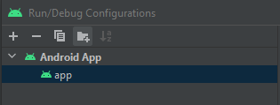

## Pre-condition

Please note that the call from the Merchant Server to the IPG Gateway API for obtaining an IPG Gateway “Session Token” has been updated. (This update is due to additional data fields mandated by 3DS-Version 2 compliance). It is a prerequisite that the Session Token passed to the Mobile SDK is obtained from that updated Get Session Token API endpoint.

## Installation

#### Manually (Recommended)

1. Clone this project or download zip file with source code, by clicking green button in top right corner:


2. If zip file was downloaded, extract it.
3. Open extracted or cloned folder, and run command in terminal:
```
git checkout <version>
```
Where `<version>` is version of SDK you want to use, e.g. `git checkout 1.0`.
All available version you can find [here](https://github.com/eservice-electronic-payments/Mobile_SDK_Android_UAT/releases)
4. Open your project in Android Studio.
5. Open file `settings.gradle` - it is in your project's root directory
6. Add this line in file:
```groovy
include ':sdk'
```
7. In app-level build.gradle file add the repository and dependency:
```groovy
repositories {
    flatDir {
        dirs project(':sdk').file('libs')
    }
}

implementation project(":sdk")
``` 

#### JitPack (Not Recommended, Only for Test Purpose)

1. Add the JitPack repository in your root build.gradle at the end of repositories:

```groovy
allprojects {
    repositories {
        ...
        maven { url 'https://jitpack.io' }
    }
}
```

or maybe in setting.gradle at the end of repositories if your gradle config is different from the default:
```groovy
dependencyResolutionManagement {
    repositoriesMode.set(RepositoriesMode.FAIL_ON_PROJECT_REPOS)
    repositories {
        ...
        maven { url 'https://www.jitpack.io' }
    }
}
rootProject.name = "yourProjectName"
include ':app'
```

2. Add the dependency of mobile sdk via Repo and Tag:

```groovy
dependencies {
       implementation 'com.github.eservice-electronic-payments:<repo>:<tag>'
}
```

Where `<repo>` is the repository name: `Mobile_SDK_Android_UAT`; `<tag>` is the version of SDK you want to use, prepend with `jp-`. Here is an example: 
```implementation 'com.github.eservice-electronic-payments:Mobile_SDK_Android_UAT:jp-2.0.4'```

## Usage

1. To use Android SDK it's necessary to fetch mobile cashier url and token from API:
​
We use http get method to obtain session token. Below is a Payload model used in request:
​
```kotlin
class DemoTokenParameters(             //example values
   action: String,                     // "AUTH"
   customerId: String,                 // "lovelyrita"
   currency: String,                   // "PLN"
   country: String,                    // "PL"
   amount: String,                     // "2.00"
   language: String,                   // "en"
   myriadFlowId: String,
   customerFirstName: String,          // "Jan"
   customerLastName: String,           // "Mobile"
   customerAddressStreet: String,      // "Abbey Rd"
   customerAddressHouseName: String,   // "1"
   customerAddressCity: String,        // "London" (full city name)
   customerAddressPostalCode: String,  // "NW6 4DN"
   customerAddressCountry: String,     // "GB" (ISO country code)
   customerAddressState: String,       // "LND" (ISO state code)
   customerPhone: String,              // Mandatory (for the 3DS2), unless not available
   customerEmail: String,              // Mandatory (for the 3DS2), unless not available
   customerIPAddress: String,          // Mandatory (for the 3DS2), unless not available
   merchantLandingPageUrl: String,     // "https://example.com" (FQDN)
   merchantNotificationUrl: String,    // "https://example.com" (FQDN)
   allowOriginUrl: String,             // "https://example.com" (FQDN)
   merchantDecMaximumWaitTime: String, // integer minute, e.g. 5
   merchantDecIndicator: String,       // "Y", "N" or ""(empty)
)
```

2. Once the cashier url and token are retrieved, call this method from your activity to display web page via SDK:
​

**Kotlin**
```kotlin
import com.evopayments.sdk.startEvoPaymentActivityForResult

class YourActivity: Activity() {
    fun startPayment() {
        startEvoPaymentActivityForResult(
            EVO_PAYMENT_REQUEST_CODE,
            merchantId,
            mobileCashierUrl,
            token,
            myriadFlowId
        )
    }
}
```
or if you use **Java**:
```java
import com.evopayments.sdk.EvoPaymentActivityKt;
        
public class YourActivity extends Activity {
    private void startPayment() {
        EvoPaymentActivityKt.startEvoPaymentActivityForResult(
            this, //Activity
            EVO_PAYMENT_REQUEST_CODE,
            merchantId,
            mobileCashierUrl,
            token,
            myriadFlowId,
            null // default timeout: 10 min    
        );
    }
}
```
3. Then in the same activity you have to override method `onActivityResults(...)` to receive payment results.
​
- `requestCode` will be exactly the same  as provided in `startEvoPaymentActivityForResult`
- `resultCode` can take following values:
```
PAYMENT_SUCCESSFUL = 1
PAYMENT_CANCELED = 2
PAYMENT_FAILED = 3
PAYMENT_UNDETERMINED = 4
PAYMENT_SESSION_EXPIRED = 5
```
​
Sample implementation of `onActivityResult(...)` can looks like this:
​

**Kotlin**
```kotlin
import com.evopayments.sdk.EvoPaymentActivity

override fun onActivityResult(requestCode: Int, resultCode: Int, data: Intent?) {
    super.onActivityResult(requestCode, resultCode, data)
    if (requestCode == EVO_PAYMENT_REQUEST_CODE) {
        when (resultCode) {
            EvoPaymentActivity.PAYMENT_SUCCESSFUL      -> onPaymentSuccessful()
            EvoPaymentActivity.PAYMENT_CANCELED        -> onPaymentCancelled()
            EvoPaymentActivity.PAYMENT_FAILED          -> onPaymentFailed()
            EvoPaymentActivity.PAYMENT_UNDETERMINED    -> onPaymentUndetermined()
            EvoPaymentActivity.PAYMENT_SESSION_EXPIRED -> onSessionExpired()
        }
    }
}
```
​
**Java**
```java
import com.evopayments.sdk.EvoPaymentActivity
        
@Override
protected void onActivityResult(int requestCode, int resultCode, Intent data) {
    super.onActivityResult(requestCode, resultCode, data);
    if (requestCode == EVO_PAYMENT_REQUEST_CODE) {
        switch (resultCode) {
            case EvoPaymentActivity.PAYMENT_SUCCESSFUL:
                onPaymentSuccessful();
                break;
            case EvoPaymentActivity.PAYMENT_CANCELED:
                onPaymentCancelled();
                break;
            case EvoPaymentActivity.PAYMENT_FAILED:
                onPaymentFailed();
                break;
            case EvoPaymentActivity.PAYMENT_UNDETERMINED:
                onPaymentUndetermined();
                break;
            case EvoPaymentActivity.PAYMENT_SESSION_EXPIRED:
                onSessionExpired();
                break;
        }
    }
}
```

## Version of 3ds library: debug vs deploy
There are two versions of the 3DS SDK included: 
1. **ipworks3ds_sdk.aar** for development (*default*)
2. **ipworks3ds_sdk_deploy.aar** for production or release
The production version includes more strict security measures that would not allow for common development processes to occur, including running with attached debuggers or using simulators/emulators.
Please make sure the production version is used in `build.gradle` of `sdk` module when publish to app store(e.g. Google Play):
```groovy
implementation(name: 'ipworks3ds_sdk_deploy', ext: 'aar')
```

## How to test with deploy version integrated
To test the app with deploy version integrated, there are 2 options:
1. Open **Run/Debug Configuration** in Android Studio as image below, and set **Install Flags**: `-i com.android.vending`
   
2. Run command below under directory where your release apk is located:
   `adb install -i "com.android.vending" -r app-release.apk` 
